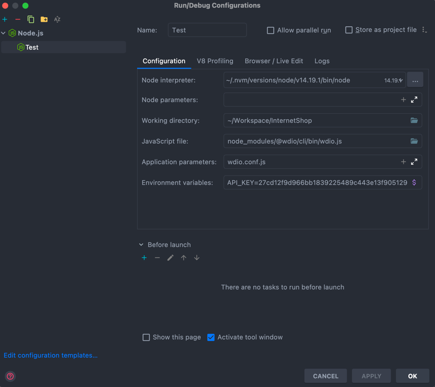

# InternetShop

Task:
Quite simple, but feel free to ask questions about needed things for test. Only requirements
 * technology - Selenium
 * solution application via GitHub/bitbucket 
 
1. navigate to https://www.newegg.com/
2. create 2-3 test cases, which will include 
 * item(s) search
 * adding to cart

To run tests locally: 
1. Run yarn 
2. Run yarn wdio

or 
Set up run configuration in your ide

API key you can use your own or use mine 27cd12f9d966bb1839225489c443e13f905129224c156d76f8263871071863da
It will be disabled in one week
